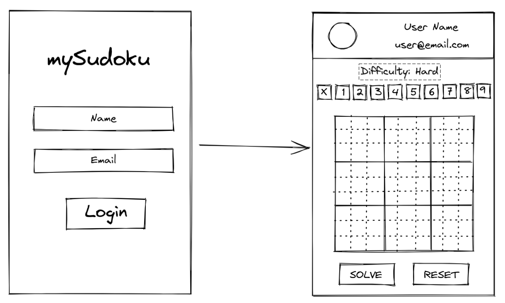

# my Sudoku

Project developed in React with Redux and TailwindCSS.


## Why does this exist?

- This was done with the intent of practicing Redux in its full state.


## How to clone it and make it run?

- Fist thing is to clone the repository into your machine.

- Than you need to enter the root folder of the project and run in your terminal the folowing: **```npm install```**
- After this process is done, just need to run **```npm start```** and your ready to go.


## Links of features, dependencies, images, API and frameworks used in this app

- [TailwindCSS v2 Documentation](https://v2.tailwindcss.com/docs)

- [Redux DevTools Repository](https://github.com/reduxjs/redux-devtools)

- [suGOku API Repository](https://github.com/bertoort/sugoku)

- [Redux Checklist Gideline](https://gist.github.com/gabriellukke/295a8e29f27125f1e4479c66f42ea57a)

- [Flaticon](https://www.flaticon.com/)

- [Freepik](https://www.freepik.com/)


# For the workshop "Do Zero ao Redux":

Instructions are based on the guideline at [Redux Checklist](https://gist.github.com/gabriellukke/295a8e29f27125f1e4479c66f42ea57a).

The application should have a layout following the standards of the scheme:




## Steps into creating the application
### Step 01 - Create all the folders
```javascript
// Redux folders
/src/actions
/src/store
/src/reducers

//React folders
/src/components
/src/pages
/src/routes

// Misc folders
/src/images
/src/services
```

### Step 02 - Create the Redux base

- Create the store at ```/src/store/index.js```.

- Create the base ```rootReducer``` at ```/src/reducers/index.js```.

- Implement the ```store``` at ```/src/index.js``` along side with the ```<Provider store={store}>...</Provider>```.


### Step 03 - Create the core of the application

- Create the page components of the app under the ```/src/pages```.

- Create the routes of the app under ```/src/routes/index.jsx```.

- Create the base components under ```/src/components```.


### Step 04 - Create the Login Page of the application

- Create it under ```/src/pages/login.jsx```.

- Create the input and the button for the login under ```/src/components/login-input.jsx``` and ```/src/components/login-button.jsx```.

- Create the user reducers under ```/src/reducers/user.js``` and implements its action under ```/src/actions/index.js```.

- Create the whole logic for the login validating the email format and having all inputs completed to enable the button.

- After the process is done, go to the title page (title page is the name tha its given to the firs page of a game, the main page of a game)


### Step 05 - Create the Title Page

- Create it under the ```/src/pages/title.jsx```.

- Create the header component under ```/src/components/header.jsx```. In the hearder will be displayed an avatar found in ```/src/images/panda.png``` alongside with the name and email of the user,stored at __Redux Storage__ under the reducer ```user```.

- Create a control bar for the game controls under ```/src/components/board-controls.jsx```. This component will be responsible for interacting with the board game.

- Create a board under the ```/src/components/board.jsx``` in which will be dispayed the board game and this will be the component responsible for rendering and requesting the API for the game values.

- Create two buttons, one will be responsible for reset the board, and other for checking the game, they will also be under the folder ```/src/components``` as ```reset-button.jsx``` and ```solve-button.jsx```.


### Step 06 - Implement the Board for the game

- Here is the core of the game, this component will be responsible for the whole logic and interaction of the board, fetching the API, rendering the game values.

- At this particular point its important to implement the handle api file under the ```/src/services/handle-api.js```. This file will have the functions for fetching the endpoints of the API. __The API is aveilible at: [suGOku](https://github.com/bertoort/sugoku)__.

- After the process is done, its time to implement the board controllers.


### Step 07 - Implement the Controller for the game

- Here is the second most important part of the project. This component will be responsible for interacting with the player and allowing tho choose the values for complete the game.

- The board controllers will be created under the ```/src/components/board-control.jsx```.
- This component will have __10__ buttons, from __1__ to __9__ and a __X__ button for cleaning a specific value of the board.

- Create the logic for clicking the button and storing the clicked value at __Redux Storage__ creating an reducer ```/src/reducer/selected-number.js```.

- Create a ```<span>...</span>``` with the difficulty of the game. That info will be aveilible on a reducer under the ```/src/reducer/solved-game.js``` which contains an object with the following:
```js
{
  difficulty: "hard",
  solution: Array[9],
  status: "solved",
},
```

### Step 08 - Implement the Solve and the Reset buttons

- Those buttons will be responsible for reset the board, requesting again the API for another game, and to solve the game to check if the player won or lost the match.

- Create a logic to fetch the API again, as you did at the __Step 06__
